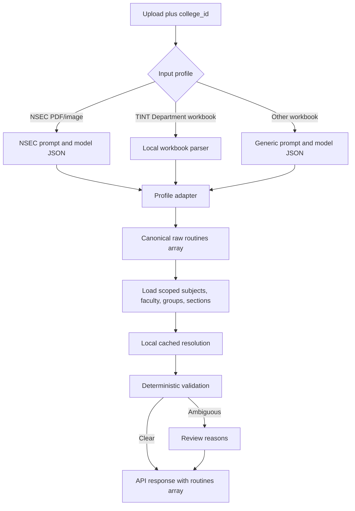

# Routine processing flow

All extraction profiles preserve visible raw values, merged period spans, and parallel activities. NSEC and generic model profiles require a top-level `routines[]` extraction object, then adapt each entry to `RoutineExtraction` before any master IDs are resolved. The TINT profile parses Department blocks locally into the same per-routine shape. Every API result, including a single timetable, has `routines[]`; each routine carries its own metadata and complete `slots[]` with activities. The LLM provider is configurable independently of the profile.

The context loader appends `college_id` to the configured master-data base URLs and fetches each college's records at most once per cache lifetime. Subject matching first scopes records by stream, course, and semester, then prefers exact code and aliases, followed by name and a conservative fuzzy match. Faculty records cache generated name initials; if several identifiers match, the routine department selects a unique match. Group matching is scoped to the routine section when the group record includes a section ID. Unknown or remaining duplicate matches remain unresolved with review reasons. No second LLM request runs automatically. Room text is retained without a room master ID.
