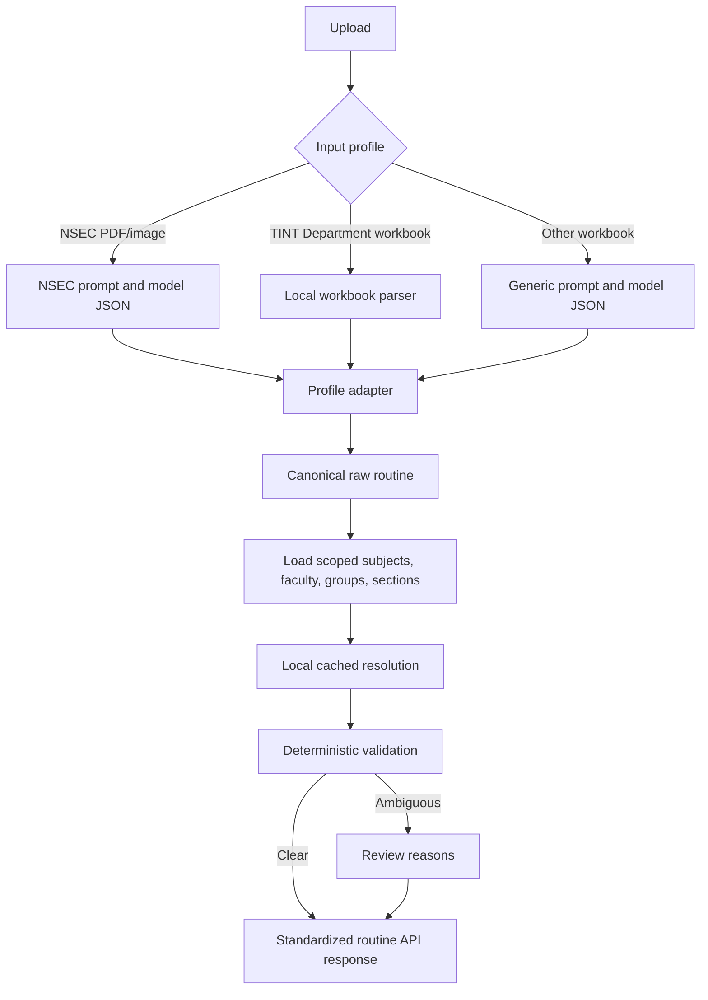

# Routine processing flow

All extraction profiles preserve visible raw values, merged period spans, and parallel activities. They produce one or more `RoutineExtraction` objects before any master IDs are resolved. The TINT profile parses Department blocks locally; the NSEC and generic profiles validate model JSON against a strict Pydantic schema. Multiple NSEC tables return a `document` collection. The LLM provider is configurable independently of the profile.

The context loader fetches each configured master-data URL at most once per cache lifetime. Subject matching first scopes records by stream, course, and semester, then prefers exact code and aliases, followed by name and a conservative fuzzy match. Faculty matching uses exact abbreviation or alias and then generated initials in the relevant department. Group matching is scoped to the routine section when the group record includes a section ID. Unknown or duplicate matches remain unresolved with review reasons. No second LLM request runs automatically. Room text is retained without a room master ID.
